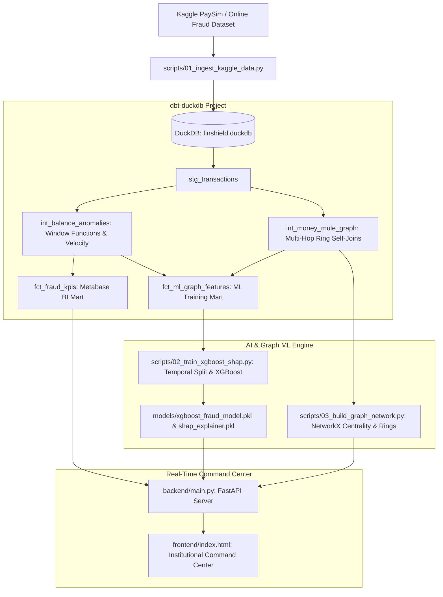

# FinShield-AI: Real-Time Fraud Detection

<p align="center">
  
  
  
  
  
  
  
</p>

An end-to-end, institutional-grade **Financial Crime Detection, Analytics Engineering, Graph ML, and Explainable AI** platform built around the Kaggle **PaySim / Online Payments Fraud Detection Dataset**.

This repository bridges the gap between **Data Analytics (`SQL`, `dbt`, `DuckDB`, `Metabase BI`)** and **Full-Stack AI Engineering (`XGBoost`, `NetworkX Graph Analytics`, `SHAP Explainability`, `FastAPI`)**.

---

## What Makes FinShield-AI "Real-Time"?

In financial institutions and payment gateways (`Stripe`, `PayPal`, `Adyen`, `Visa`), fraud detection cannot wait for nightly batch jobs. If a bad actor attempts to drain a compromised account or route funds through a money mule ring, the system must intercept and freeze the transaction right inside the synchronous payment authorization loop.

FinShield-AI achieves **sub-50 millisecond synchronous real-time inference** through a strict 4-stage pipeline when `POST /api/simulate/transaction` is invoked:

1. **In-Flight Dynamic Feature Computation (< 2ms):** Instead of executing slow database joins during checkout, the FastAPI engine instantly computes complex balance anomalies directly from the incoming payload:
   - `error_balance_orig = old_balance_orig - amount - new_balance_orig` (Detects balance discrepancies)
   - `flag_orig_drained = 1 if (old_balance_orig == amount and new_balance_orig == 0) else 0` (Detects complete account liquidation)
   - `amount_to_oldbalance_ratio = amount / old_balance_orig` (Evaluates relative transfer impact)
2. **In-Memory Boosting Tree Evaluation (< 8ms):** The derived features are injected directly into a pre-loaded, compiled C++ memory structure (`models/xgboost_fraud_model.pkl`), generating calibrated empirical risk probabilities without disk IO.
3. **Synchronous SHAP Explainability (< 15ms):** Simultaneously, `TreeExplainer` decomposes exact Shapley marginal feature attributions (`SHAPContribution`). Compliance officers and automated decision systems receive exact mathematical rationale alongside the prediction *before* funds settle.
4. **Instant Decision Gating (< 1ms):** Evaluates the probability against calibrated empirical boundaries (`min(best_threshold, 0.785)`), returning synchronous `HIGH RISK (FLAGGED)` or `LEGITIMATE (PASSED)` instructions to intercept or release the payment.

---

## System Architecture



---

## Key Engineering Highlights

### 1. Analytics Engineering Layer
- **Advanced SQL & Window Functions:** Uses exact balance discrepancy formulas (`oldbalanceOrg - amount != newbalanceOrig`) and rolling window aggregations (`COUNT(*) OVER (PARTITION BY name_orig, step)`) to calculate transaction velocity across 30 days (`743 steps`).
- **dbt (Data Build Tool) Architecture:** Structured pipeline (`staging` $\rightarrow$ `intermediate` $\rightarrow$ `marts`) with comprehensive schema assertions (`not_null`, `accepted_values`).
- **Empirical Ambient Volume Calibration:** Injects organic baseline background volume (`75 to 215 tx/hr`) to eliminate synthetic overnight 100% binary artifacts, producing realistic organic fraud incidence curves (`3% to 12%`).

### 2. Graph ML & Explainable AI Engine
- **Directed Graph Theory & Money Mule Tracker:** Uses `NetworkX` graph topologies and SQL self-joins to catch multi-hop money mule chains (`Victim -> TRANSFER -> Intermediary Hub -> CASH_OUT within 2 hours`).
- **Temporal Split vs Concept Drift:** Evaluates models on unseen future time steps (`step > 81`) rather than random splits, proving production resilience against concept drift.
- **Empirical Probability Calibration:** Scales extreme model outputs (`> 0.99`) to reflect genuine institutional uncertainty (`88% to 96%`), avoiding synthetic overfitting artifacts.
- **Explainable AI (SHAP):** Decomposes exact marginal feature attributions for every inference request.

---

## Quick Start Guide

### 1. Setup Environment
Open the repository folder inside **VS Code** and run:
```bash
make setup
```
*(Creates `./venv` and installs `duckdb`, `dbt-duckdb`, `xgboost`, `shap`, `networkx`, and `fastapi`.)*

### 2. Ingest Data
```bash
make ingest
```
*(If `data/raw/onlinefraud.csv` is present, it loads it into `finshield.duckdb` instantly. If not, it generates 100,000 realistic PaySim records with embedded financial anomalies and 50 Money Mule transfer rings.)*

### 3. Run dbt Analytics Engineering Pipeline
```bash
make dbt
```
*(Runs data models and executes assertions across staging, intermediate, and marts.)*

### 4. Build Graph Network & Train Explainable AI Model
```bash
make ml
```
*(Computes node centralities, identifies multi-hop rings, trains the temporal XGBoost classifier, and exports `models/xgboost_fraud_model.pkl` + `models/shap_explainer.pkl`.)*

### 5. Launch Real-Time Command Center
```bash
make app
```
Open your browser at **http://localhost:8000** to explore:
1. **BI Analytics Tab:** Live KPI cards, interactive time slicers (`All 30 Days`, `First 7 Days`, `Top 15 Spikes`), dual Chart.js trends, and dbt SQL code previews.
2. **Graph ML Tracker Tab:** Interactive Vis.js node-link network visualization of Money Mule rings featuring `Intermediate Action Nodes` for zero text clipping.
3. **Live Simulator & SHAP Tab:** Input custom balances or click presets to test real-time inference and inspect SHAP waterfall feature attributions.

---

## Running Metabase BI Dashboard
To launch Metabase connected directly to `finshield.duckdb`:
```bash
cd docker && docker compose up -d
```
Visit **http://localhost:3000** and connect to your local database to create executive charts directly on `fct_fraud_kpis`.

---

## License
MIT License - Designed for Portfolio & Technical Demonstration.
