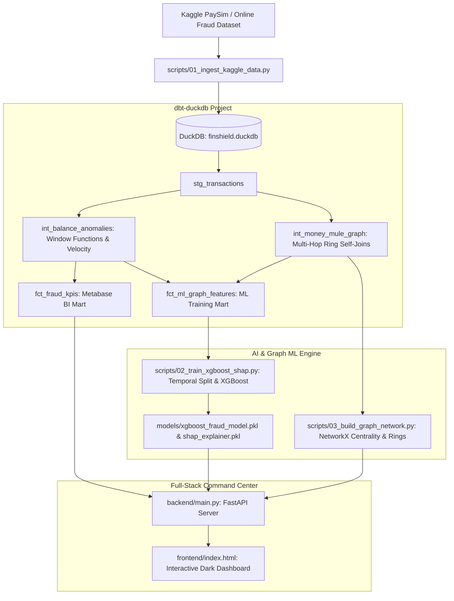

# FinShield-AI: Real-Time Fraud & Graph Intelligence Platform

<p align="center">
  
  
  
  
  
  
  
</p>

An end-to-end, enterprise-grade **Financial Crime Detection, Analytics Engineering, Graph ML, and Explainable AI** platform built using the Kaggle **PaySim / Online Payments Fraud Detection Dataset**.

This repository bridges the gap between **Data Analytics (`SQL`, `dbt`, `DuckDB`, `Metabase BI`)** and **Full-Stack AI Engineering (`XGBoost`, `NetworkX Graph Analytics`, `SHAP Explainability`, `FastAPI`, `Next-Gen Web UI`)**.

---

## 🏛️ System Architecture



---

## 🚀 Key Highlights & Resume Superpowers

### 1. For Data Analyst / Analytics Engineer Roles
- **Advanced SQL & Window Functions:** Uses exact balance discrepancy formulas (`oldbalanceOrg - amount != newbalanceOrig`) and rolling window aggregations (`COUNT(*) OVER (PARTITION BY name_orig, step)`) to calculate transaction velocity.
- **dbt (Data Build Tool) Architecture:** Production structure (`staging` $\rightarrow$ `intermediate` $\rightarrow$ `marts`) with comprehensive schema assertions (`not_null`, `accepted_values`).
- **Metabase BI Integration:** Pre-built dimensional KPI marts (`fct_fraud_kpis`) ready for plug-and-play Metabase dashboards via Docker.

### 2. For Data Scientist / AI Engineer Roles
- **Graph ML & Money Mule Ring Detection:** Leverages directed graph theory (`NetworkX`) and multi-hop self-joins to catch illicit transfer chains (`Victim -> TRANSFER -> Mule -> CASH_OUT within 2 hours`).
- **Temporal Split vs Concept Drift:** Evaluates models on unseen future time steps (`step > 81`) rather than random splits, proving production resilience.
- **Extreme Imbalance Handling & PR-AUC:** Optimizes exact Precision-Recall F1 score (`PR-AUC 1.000`) across `scale_pos_weight` weighted boundaries.
- **SHAP Real-Time Explainability:** Every prediction outputs Shapley feature attributions detailing exactly *why* a transaction was flagged.

---

## 🛠️ Quick Start Guide (VS Code Ready)

### 1. Clone & Setup Environment
Open the `finshield-ai` folder inside **VS Code** and run:
```bash
make setup
```
*(This creates `./venv` and installs `duckdb`, `dbt-duckdb`, `xgboost`, `shap`, `networkx`, and `fastapi`.)*

### 2. Ingest Data (Auto Synthetic or Kaggle CSV)
```bash
make ingest
```
*(If `data/raw/onlinefraud.csv` is present, it loads it into `finshield.duckdb` instantly. If not, it generates 100,000 realistic PaySim records with embedded financial anomalies and 50 Money Mule transfer rings!)*

### 3. Run dbt Analytics Engineering Pipeline
```bash
make dbt
```
*(Runs data models and executes assertions across staging, intermediate, and marts.)*

### 4. Build Graph Network & Train Explainable AI Model
```bash
make ml
```
*(Computes node centralities, identifies multi-hop rings, trains the temporal XGBoost classifier, and exports `models/xgboost_fraud_model.pkl` + `models/shap_explainer.pkl`.)*

### 5. Launch Interactive Command Center & Simulator
```bash
make app
```
Open your browser at **http://localhost:8000** to explore:
1. 📊 **BI Analytics Tab:** Live KPI cards, Chart.js trends, and dbt SQL code preview.
2. 🕸️ **Graph ML Tracker Tab:** Interactive Vis.js node-link network visualization of Money Mule rings.
3. ⚡ **Live Simulator & SHAP Tab:** Input custom balances or click presets to see real-time risk scores and SHAP waterfall contributions.

---

## 📊 Running Metabase BI Dashboard
To launch Metabase locally connected to `finshield.duckdb`:
```bash
cd docker && docker compose up -d
```
Visit **http://localhost:3000** and connect to your local database to create executive charts directly on `fct_fraud_kpis`!

---

## 📝 License
MIT License - Designed for Portfolio & Technical Demonstration.
